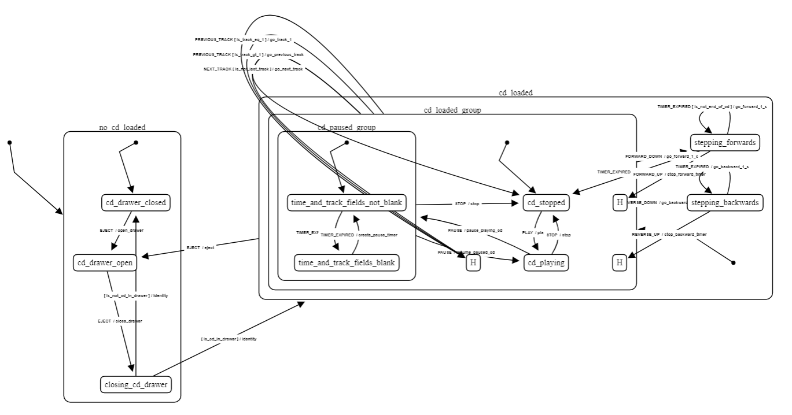
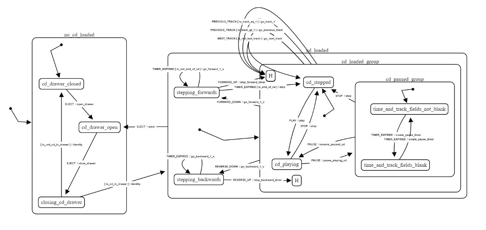
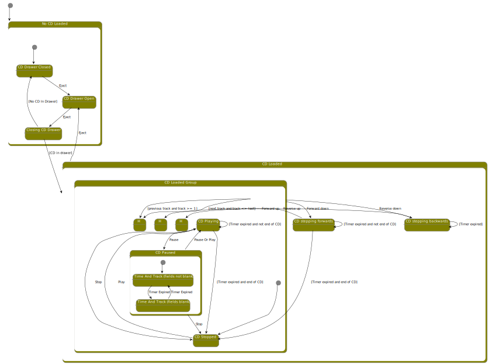

# State transducer visualization tool
This online tool consists of one window where the state transducer specification is to be 
entered; a button which when click triggers the display the graph visualization for the 
transducer, and last a window holding the graph visualization itself.

The format for the specification is immediately derived from the transducer format `FSM_Dek` from
 our [state machine library](https://github.com/brucou/state-transducer) with the following rules :
 
 - we only keep the properties `states` and `transitions` from `FSM_Def`
 - functions (e.g. predicates and actions) are replaced by their name

We thus end like with a JSON-like format.

The initial window starts with the example specification for a CD player : 

```JSON
  {
    "states": ["nok", [
      ["no_cd_loaded", [
        "cd_drawer_closed",
        "cd_drawer_open",
        "closing_cd_drawer"
      ]],
      ["cd_loaded", [
        ["cd_loaded_group", [
          ["cd_paused_group", [
            "time_and_track_fields_not_blank",
            "time_and_track_fields_blank"
          ]],
          "cd_playing",
          "cd_stopped"
        ]],
        "stepping_forwards",
        "stepping_backwards"
      ]]
    ]],
    "transitions": [
      { "from": "nok", "to": "no_cd_loaded", "event": "init", "action": "fsm_initialize_model" },
      { "from": "no_cd_loaded", "to": "cd_drawer_closed", "event": "init", "action": "identity" },
      { "from": "cd_drawer_closed", "to": "cd_drawer_open", "event": "EJECT", "action": "open_drawer" },
      { "from": "cd_drawer_open", "to": "closing_cd_drawer", "event": "EJECT", "action": "close_drawer" },
      {
        "from": "closing_cd_drawer", "guards": [
          { "predicate": "is_not_cd_in_drawer", "to": "cd_drawer_closed", "action": "identity" },
          { "predicate": "is_cd_in_drawer", "to": "cd_loaded", "action": "identity" }
        ]
      },
      { "from": "cd_loaded", "to": "cd_loaded_group", "event": "init", "action": "identity" },
      { "from": "cd_playing", "to": "cd_paused_group", "event": "PAUSE", "action": "pause_playing_cd" },
      { "from": "cd_paused_group", "to": "cd_playing", "event": "PAUSE", "action": "resume_paused_cd" },
      { "from": "cd_paused_group", "to": "cd_playing", "event": "PLAY", "action": "resume_paused_cd" },
      { "from": "cd_paused_group", "to": "time_and_track_fields_not_blank", "event": "init", "action": "identity" },
      {
        "from": "time_and_track_fields_not_blank",
        "to": "time_and_track_fields_blank",
        "event": "TIMER_EXPIRED",
        "action": "create_pause_timer"
      },
      {
        "from": "time_and_track_fields_blank",
        "to": "time_and_track_fields_not_blank",
        "event": "TIMER_EXPIRED",
        "action": "create_pause_timer"
      },
      { "from": "cd_paused_group", "to": "cd_stopped", "event": "STOP", "action": "stop" },
      { "from": "cd_stopped", "to": "cd_playing", "event": "PLAY", "action": "play" },
      { "from": "cd_playing", "to": "cd_stopped", "event": "STOP", "action": "stop" },
      { "from": "cd_loaded_group", "to": "cd_stopped", "event": "init", "action": "stop" },
      {
        "from": "cd_loaded_group", "event": "NEXT_TRACK", "guards": [
          { "predicate": "is_last_track", "to": "cd_stopped", "action": "stop" },
          { "predicate": "is_not_last_track", "to": "history.cd_loaded_group", "action": "go_next_track" }
        ]
      },
      {
        "from": "cd_loaded_group", "event": "PREVIOUS_TRACK", "guards": [
          { "predicate": "is_track_gt_1", "to": "history.cd_loaded_group", "action": "go_previous_track" },
          { "predicate": "is_track_eq_1", "to": "history.cd_loaded_group", "action": "go_track_1" }
        ]
      },
      { "from": "cd_loaded", "to": "cd_drawer_open", "event": "EJECT", "action": "eject" },
      {
        "from": "stepping_forwards", "event": "TIMER_EXPIRED", "guards": [
          { "predicate": "is_not_end_of_cd", "to": "stepping_forwards", "action": "go_forward_1_s" },
          { "predicate": "is_end_of_cd", "to": "cd_stopped", "action": "stop" }
        ]
      },
      { "from": "stepping_forwards", "to": "history.cd_loaded_group", "event": "FORWARD_UP", "action": "stop_forward_timer" },
      { "from": "cd_loaded_group", "to": "stepping_forwards", "event": "FORWARD_DOWN", "action": "go_forward_1_s" },
      { "from": "stepping_backwards", "to": "stepping_backwards", "event": "TIMER_EXPIRED", "action": "go_backward_1_s" },
      { "from": "stepping_backwards", "to": "history.cd_loaded_group", "event": "REVERSE_UP", "action": "stop_backward_timer" },
      { "from": "cd_loaded_group", "to": "stepping_backwards", "event": "REVERSE_DOWN", "action": "go_backward_1_s" }
    ]
  }
```

You can modify directly the specifications manually, and click the generate graph buttons when 
you are done. At this point of time, there is nothing done in term of error management. This 
means that if your modification of the graph is incorrect, the display will not be updated, with 
no visible error message displayed (there might be some indications on what went wrong in the 
console though). 

# Adjusting
Dagre does some nice visualizations. However they often have to be manually adjusted. We use 
cytoscape as a graph visualization library as it allows to adjust the graph manually. 

For example, here is the automatic visualization generated by the Dagre layout engine for the CD 
player specification :



Here is the result of a manual adjustment, to have less edge-crossing and more readable labels :



For information, PlantUML not so good for visualizing complex state machines. However it is 
still useful as the generated SVG can be customized at will.



In conclusion, such an automatic visualization is useful. Even though it has to be improved 
manually, a good part of the layout is already done. It will be interesting in a future version 
to investigate how other engines display complx compound graphs.

## Quick start
- `npm run parcel`
- then open a web browser at the indicated address (should be displayed as a link in your 
terminal after running parcel)

## Visualization parameters
Compound state entry transitions are represented by 2-segments line. History states have `H` as 
state name. Self-loop are forced to Bezier curves. Other parameters could be used. To modify 
them, see the code.

## Documentation
That `README.md` essentially. For details about the state transducer library, its motivation and 
format, please refer to the corresponding [github directory](https://github.com/brucou/state-transducer).

## Contributing

Anyone is welcome to contribute,
however, if you decide to get involved, please take a moment to review
the [guidelines](.github/CONTRIBUTING.md):

* [Bug reports](.github/CONTRIBUTING.md#bugs)
* [Feature requests](.github/CONTRIBUTING.md#features)
* [Pull requests](.github/CONTRIBUTING.md#pull-requests)


## License

The code is available under the [MIT license](LICENSE.txt).
